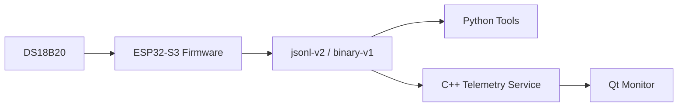

# ESP32 Temperature Telemetry Platform

基于 `ESP32-S3`、`DS18B20`、`Python` 工具链和 `Qt/C++` 上位机的双通道温度遥测与故障诊断平台。

项目实现了从设备端采集、协议传输、串口工具、桌面监控到配置管理的完整链路，支持真实传感器输入、模拟热通道、双协议输出、离线回放和真机稳定性验证。

## 项目简介

设备端基于 `ESP32-S3 + FreeRTOS` 采集真实 `DS18B20` 温度，并同时生成一条模拟热通道；链路层支持 `jsonl-v2` 和 `binary-v1` 两种协议；工具侧提供 `Python` 串口抓包与配置读写；桌面侧基于 `C++/Qt` 实现实时监控、趋势展示、故障查看和配置管理。

当前系统包含两条通道：

- `channel_0 = real_ds18b20`
- `channel_1 = simulated_hot_channel`

其中模拟热通道用于稳定复现越阈值场景，便于协议验证、上位机展示和故障演示。

## 主要功能

### 设备端

- 真实 `DS18B20` 温度采集
- 双通道数据模型与诊断状态机
- `heartbeat / telemetry / fault / config / command_ack` 消息输出
- 配置读写与 `NVS` 持久化

### 工具链

- 串口自动识别协议
- `jsonl / csv / bin` 日志落盘
- 设备配置查询、更新与协议切换
- 回放样例生成与稳定性统计

### 桌面端

- 实时显示双通道温度与设备在线状态
- 最近 `120 s` 趋势曲线
- 故障历史与当前活动告警
- 配置草稿、本地预设、设备参数查询与写回
- 真机串口模式与离线回放模式

## 系统架构



## 已验证结果

### 5 分钟真机稳定性记录

- 持续时长：约 `292.0 s`
- `telemetry` 行数：`432`
- `heartbeat`：`41`
- `fault`：`0`

### 30 分钟真机稳定性记录

- 持续时长：约 `1794.0 s`
- `telemetry` 行数：`3256`
- `heartbeat`：`326`
- `fault`：`0`

### 通道结果摘要

- `channel_0`
  - 温度范围：`21.94 C ~ 22.63 C`
  - 状态：全程 `ok`
- `channel_1`
  - 温度范围：`34.0 C ~ 37.6 C`
  - 状态分布：`ok = 1301`，`overtemp = 327`

## 快速开始

### 1. 构建与烧录固件

```powershell
cd C:\code\esp32-temperature-telemetry-platform\firmware\esp32_s3_node
idf.py set-target esp32s3
idf.py build
idf.py -p COM3 flash
idf.py -p COM3 monitor
```

### 2. 运行 Python 抓包工具

```powershell
cd C:\code\esp32-temperature-telemetry-platform
python -m pip install -r tools\scripts\requirements-serial.txt
python tools\scripts\uart_capture.py --port COM3 --baud 115200 --mode auto --duration 30
```

### 3. 查询设备配置

```powershell
C:\Espressif\tools\python\v5.4.3\venv\Scripts\python.exe C:\code\esp32-temperature-telemetry-platform\tools\scripts\device_config_tool.py --port COM3 --baud 115200 --mode binary --response-mode auto get
```

### 4. 构建桌面端

```powershell
powershell -ExecutionPolicy Bypass -File C:\code\esp32-temperature-telemetry-platform\tools\scripts\desktop_build.ps1
```

### 5. 启动回放演示

```powershell
powershell -ExecutionPolicy Bypass -File C:\code\esp32-temperature-telemetry-platform\tools\scripts\run_desktop_demo.ps1 -Mode binary -ResetProcesses
```

### 6. 运行长时间稳定性采集

```powershell
powershell -ExecutionPolicy Bypass -File C:\code\esp32-temperature-telemetry-platform\tools\scripts\run_stability_capture.ps1 -Port COM3 -Baud 115200 -Mode auto -DurationSeconds 1800
```

## 项目结构

```text
esp32-temperature-telemetry-platform/
|-- firmware/
|   `-- esp32_s3_node/
|-- desktop/
|   |-- common/
|   |-- serial_link/
|   |-- packet_codec/
|   |-- telemetry_service/
|   `-- qt_monitor/
|-- tools/
|   `-- scripts/
|-- data/
|   `-- samples/
`-- README.md
```

## 技术栈

- 固件：`ESP-IDF`、`FreeRTOS`、`C++`
- 传感器：`DS18B20`
- 通信：`UART`、`jsonl-v2`、`binary-v1`
- 工具：`Python`
- 桌面端：`C++`、`Qt Widgets`
- 构建：`CMake`
