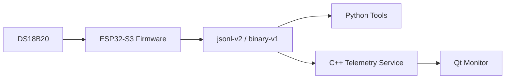

# ESP32 Temperature Telemetry Platform

一个基于 `ESP32-S3`、`DS18B20`、`Python` 工具链和 `Qt/C++` 上位机的双通道温度遥测与故障诊断项目。

这个项目不是单纯“读温度 + 画界面”，而是把设备端固件、通信协议、调试工具、桌面监控、配置管理和真机验证串成了一条完整链路。它的价值在于：你能直接看到一个嵌入式项目从硬件采集到上位机展示是怎么闭环的。

## 这个项目做了什么

- 用 `ESP32-S3 + FreeRTOS` 采集真实 `DS18B20` 温度
- 在设备端同时生成一条模拟热通道，用来稳定复现越阈值场景
- 实现 `jsonl-v2` 和 `binary-v1` 两套协议
- 编写 `Python` 串口工具，用于抓包、落盘、配置查询和写回
- 编写 `C++` 服务层，负责串口接入、协议解码、状态缓存和离线判定
- 编写 `Qt` 监控端，提供 `Overview / Trend / Faults / Config` 四页界面
- 做了真机联调、异常路径验证和长时间稳定性记录

## 系统结构



当前系统有两条通道：

- `channel_0 = real_ds18b20`
- `channel_1 = simulated_hot_channel`

其中第二条是模拟热通道，用来稳定制造 `overtemp` 场景，方便调试、演示和验证。

## 面试官能看到什么

如果把这个项目当成求职作品来看，它主要能证明这几件事：

- 你能做真实硬件接入，而不是纯仿真
- 你能做设备端、协议、工具链和上位机的完整闭环
- 你能处理正常路径和异常路径，而不是只跑 happy path
- 你会做配置管理、状态缓存、回放链路和稳定性验证

## 已完成并验证的内容

### 设备端

- 真实 `DS18B20` 采集正常
- 双通道模型正常
- `heartbeat / telemetry / fault / config / command_ack` 消息已跑通
- 配置读写与 `NVS` 持久化已验证

### 工具链

- `Python` 串口抓包正常
- 支持 `jsonl / csv / bin` 落盘
- 配置查询、写回、协议切换已验证

### 桌面端

- `Overview / Trend / Faults / Config` 四页可运行
- 支持真机串口模式
- 支持离线回放模式

### 真机验证

- 已完成 `5 min` 真机连续采集
- 已完成 `30 min` 真机连续采集
- 已验证传感器断开后的异常路径
- 已验证模拟热通道的 `overtemp` 场景

## 关键结果

### 5 分钟真机记录

- 持续时长：约 `292.0 s`
- `telemetry`：`432`
- `heartbeat`：`41`
- `fault`：`0`

### 30 分钟真机记录

- 持续时长：约 `1794.0 s`
- `telemetry`：`3256`
- `heartbeat`：`326`
- `fault`：`0`

### 通道摘要

- `channel_0`
  - 温度范围：`21.94 C ~ 22.63 C`
  - 状态：全程 `ok`
- `channel_1`
  - 温度范围：`34.0 C ~ 37.6 C`
  - 状态分布：`ok = 1301`，`overtemp = 327`

这些数据说明项目不是“搭出来摆拍”，而是经过了连续真机运行验证。

## 快速运行

### 固件构建与烧录

```powershell
cd C:\code\esp32-temperature-telemetry-platform\firmware\esp32_s3_node
idf.py set-target esp32s3
idf.py build
idf.py -p COM3 flash
idf.py -p COM3 monitor
```

### Python 抓包

```powershell
cd C:\code\esp32-temperature-telemetry-platform
python -m pip install -r tools\scripts\requirements-serial.txt
python tools\scripts\uart_capture.py --port COM3 --baud 115200 --mode auto --duration 30
```

### 配置查询

```powershell
C:\Espressif\tools\python\v5.4.3\venv\Scripts\python.exe C:\code\esp32-temperature-telemetry-platform\tools\scripts\device_config_tool.py --port COM3 --baud 115200 --mode binary --response-mode auto get
```

### 桌面端构建

```powershell
powershell -ExecutionPolicy Bypass -File C:\code\esp32-temperature-telemetry-platform\tools\scripts\desktop_build.ps1
```

### 回放演示

```powershell
powershell -ExecutionPolicy Bypass -File C:\code\esp32-temperature-telemetry-platform\tools\scripts\run_desktop_demo.ps1 -Mode binary -ResetProcesses
```

## 项目结构

```text
esp32-temperature-telemetry-platform/
|-- firmware/
|   `-- esp32_s3_node/
|-- desktop/
|   |-- common/
|   |-- serial_link/
|   |-- packet_codec/
|   |-- telemetry_service/
|   `-- qt_monitor/
|-- tools/
|   `-- scripts/
|-- data/
|   `-- samples/
`-- README.md
```

## 技术栈

- 固件：`ESP-IDF`、`FreeRTOS`、`C++`
- 传感器：`DS18B20`
- 通信：`UART`、`jsonl-v2`、`binary-v1`
- 工具：`Python`
- 桌面端：`C++`、`Qt Widgets`
- 构建：`CMake`
